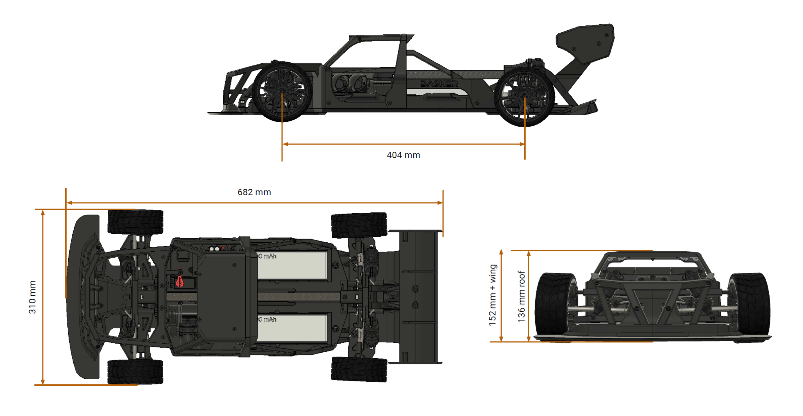

# **Technical Specification**

## **1. General Information**
- **Model Name**: StreetBASHER  
- **Type**: High-performance RC Car Chassis (3D Printable)  
- **Application**: Hobbyist & Competitive RC Car Racing  
- **Scale**: Approx. 1:8  

## **2. Dimensions**
- **Overall Length**: 682 mm  
- **Wheelbase**: 404 mm  
- **Overall Width**: 310 mm  
- **Overall Height**:  
  - 136 mm (roof height)  
  - 152 mm (including rear wing)  

## **3. Chassis & Frame**
- **Material**:  
  - **Recommended Filaments**: PLA+ (for prototyping), PETG, ABS, or Nylon (for durability)  
  - **Reinforced Sections**: Carbon Fiber Nylon (for stress-prone areas)  
- **Construction**: Modular frame with a reinforced roll cage  
- **Mounting Points**: Designed for M3 & M4 bolts for securing electronic components  
- **Battery Tray Size**: Fits standard 2S-4S LiPo battery packs  
- **Cooling & Ventilation**: Open-frame design for airflow  

## **4. Suspension System**
- **Independent Suspension**: Double wishbone front & rear  
- **Shock Mounting**: Adjustable shock absorber mounting points  
- **Shock Absorbers**: 3D-printable dampers (supports oil-filled aluminum shocks for better performance)  

## **5. Drivetrain & Wheels**
- **Drive Type**: 4WD (Modular for RWD conversion)  
- **Differentials**: Space for customizable gear differentials  
- **Wheel Hub Mount**: 12 mm hex hubs (compatible with standard RC wheels)  
- **Tire Compatibility**: Off-road & on-road rubber tires (3D-printable wheels with TPU tires)  

## **6. Electronics & Powertrain**
- **Motor Mounting**: Supports 540/550 brushless or brushed motors  
- **ESC Mounting**: Space for 60A-120A ESC with ventilation slots  
- **Servo Mount**: Standard 25T servo horn compatibility  
- **Receiver & Electronics Bay**: Dedicated space for receiver & wiring management  
- **Battery Type**: LiPo 2S-4S compatible with secure mounting  

## **7. Aerodynamics & Body Design**
- **Front Splitter**: Designed for downforce and handling stability  
- **Rear Wing**: Adjustable wing for aerodynamic tuning  
- **Body Panels**: Modular, detachable panels for easy replacement  
- **3D Printability Considerations**:  
  - Split into sections for easy printing and assembly  
  - Support-free design where possible  
  - Optimized wall thickness for weight reduction  

## **8. Assembly & Hardware Requirements**
- **Fasteners**: M3 & M4 screws, lock nuts, washers  
- **Bearings**: 8x16x5 mm standard RC bearings  
- **Axles & Drive Shafts**: Compatible with 3D-printed or metal options  

## **9. Printing Guidelines**
- **Recommended Print Settings**:  
  - **Layer Height**: 0.2 mm for fine detail, 0.3 mm for strength  
  - **Infill**: 30%-50% (higher in stress areas)  
  - **Wall Thickness**: 2-3 mm for structural parts  
  - **Supports**: Minimal (optimized for overhangs and bridges)  
- **Material Notes**:  
  - PLA+ for prototyping  
  - PETG or ABS for functional parts  
  - TPU for flexible parts (bumpers, tires)  
  - Carbon Fiber Nylon for chassis reinforcement  