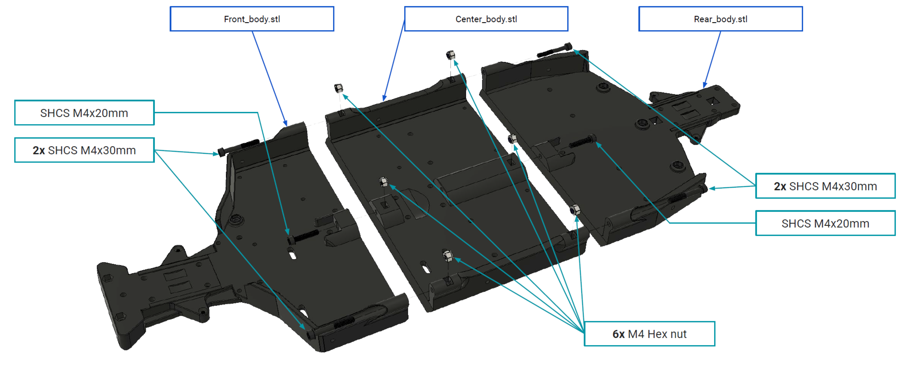

# Chassis Assembly 

## Chassis Components

The chassis is composed of three main parts:

- **Front_body.stl** - The front section of the chassis, which houses essential components such as the steering mechanism.
- **Center_body.stl** - The middle section of the chassis, which connects the front and rear sections and serves as the structural base for the electronic components.
- **Rear_body.stl** - The rear section of the chassis, which provides mounting points for the drivetrain and suspension components.

## Fasteners and Assembly Hardware
The assembly of the chassis requires the following fasteners:

- **SHCS (Socket Head Cap Screw) M4x20mm** - Used to join the front and center chassis sections.
- **2x SHCS M4x30mm** - Used to reinforce the connection between the front and center chassis.
- **2x SHCS M4x30mm** - Used to connect the center and rear chassis sections.
- **SHCS M4x20mm** - Additional reinforcement screw for securing the rear chassis.
- **6x M4 Hex Nuts** - Used to secure the M4 screws and prevent loosening during operation.

## Assembly Instructions

### Step 1: Preparing the Parts

1. Print the three chassis parts: **Front_body.stl, Center_body.stl, and Rear_body.stl** using a high-strength filament such as PETG or ABS for durability.
2. Ensure all printed parts are clean and free of excess filament or debris.

### Step 2: Connecting the Front and Center Sections

1. Align the **Front_body.stl** and **Center_body.stl** so that the mounting holes match.
2. Insert **SHCS M4x20mm** into the designated holes and loosely secure them.
3. Insert **2x SHCS M4x30mm** for added stability.
4. Attach **M4 Hex Nuts** to the screws and tighten them securely using an Allen key and a wrench.

### Step 3: Connecting the Center and Rear Sections

1. Align the **Center_body.stl** with **Rear_body.stl**, ensuring a proper fit.
2. Insert **2x SHCS M4x30mm** through the mounting holes.
3. Secure the screws using **M4 Hex Nuts** and tighten appropriately.
4. Insert the additional **SHCS M4x20mm** as a reinforcement screw and secure it with an **M4 Hex Nut**.

### Step 4: Final Tightening and Inspection

1. Verify all screws are tightened securely but not overtightened to avoid damaging the plastic.
2. Ensure that the chassis sections are properly aligned and free from gaps.
3. Check the structural integrity by applying light pressure to confirm a rigid connection.

